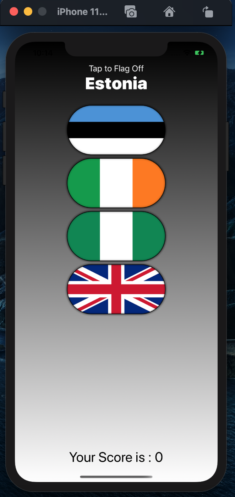
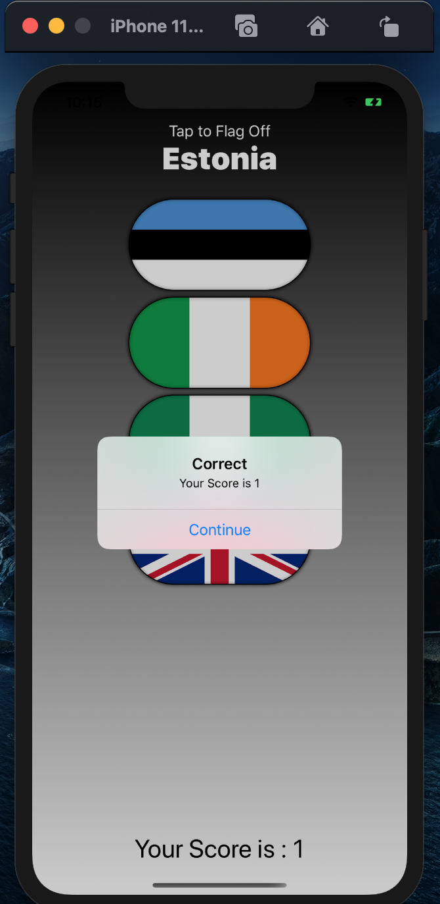
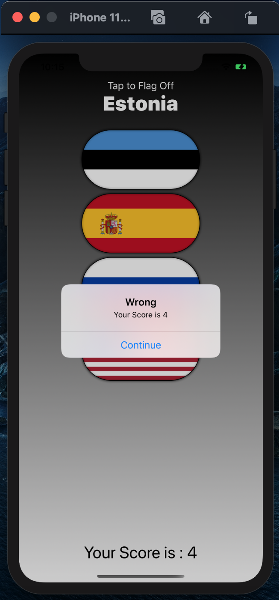

# GuessTheFlag
Guess the flag is an iOS game app where you have to guess the country flags.

## support our work and do Star this Repository Or Fork this Repository

## Built With 🛠
- [SwiftUi](https://developer.apple.com/xcode/swiftui/)

     
    

**if you guess the correct country flag then the score will increase**

 

    

*else the score will decrease*

